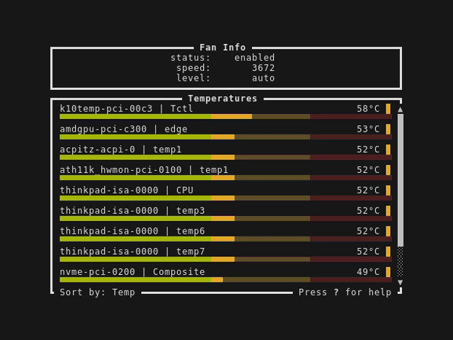

# thinkfan-tui

A terminal-based Linux application for fan control and temperature
monitoring on ThinkPad laptops.



## How it Works?

The application continously runs the `sensors` command to read
temperatures and display these in the terminal. To control the fan speed,
commands are written to the `/proc/acpi/ibm/fan` file. If the user lacks
permissions to do so the owner of the file is changed to the current
user by calling the `pkexec` command.

## Keyboard Shortcuts

| Key  | Action                          |
| ---- | ------------------------------- |
| 0..7 | Set fan speed to specific level |
| A    | Set fan speed to automatic      |
| F    | Set fan speed to full           |
| S    | Toggle sorting                  |
| ?    | Show help window                |
| Q    | Quit application                |

## Tested Laptops

- T14s AMD Gen 1
- T14s AMD Gen 4
- T490
- E14 Intel Gen 6
- ThinkPad P1 Gen 2

## Getting Started

### Dependencies

The project uses `lm-sensors` and `policykit`. These can be installed
with the commands below.

#### Ubuntu

```
sudo apt install lm-sensors policykit-1
```

#### Arch Linux

```
sudo pacman -S lm_sensors polkit
```

### Installing

#### Using crates.io (preferred)

This project is written in the rust programming language
and is built using the cargo package manager, see
https://www.rust-lang.org/tools/install for installation instructions.

After rust and cargo is installed you can install `thinkfan-tui` from
crates.io by running:

```
cargo install thinkfan-tui
```

#### Arch User Repository (AUR)

For Arch Linux users the package is available in the AUR:
https://aur.archlinux.org/packages/thinkfan-tui

#### Pre-built

There are also pre-built binaries available at
https://github.com/karjonas/thinkfan-tui/releases. Unzip the binary,
make it executable and run.

## Troubleshooting

If the application does not let you update the fan speeds, make sure that the `thinkpad_acpi` kernel module is loaded with fan control enabled. To reload it temporarily, run the following commands:

```
sudo modprobe -r thinkpad_acpi
sudo modprobe thinkpad_acpi fan_control=1
```

## Contributing

Please report any issues you find at
https://github.com/karjonas/thinkfan-tui/issues. If your laptop model
is not in the list of tested laptops, feel free to test it add it to
the list. Outputs from the `sensors -j` command are also appreciated
for more test coverage on different laptops.

## License

Distributed under the MIT License. See LICENSE for more information.

## Contact

This project is hosted at https://github.com/karjonas/thinkfan-tui

## Acknowledgements

`thinkfan-tui` is inspired by
[Thinkfan UI](https://github.com/zocker-160/thinkfan-ui).
